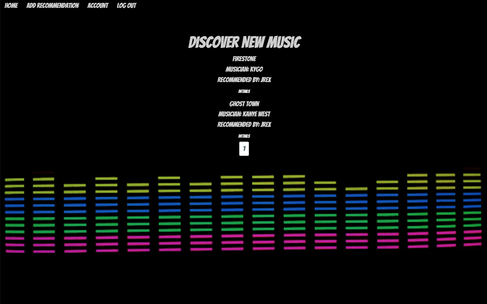
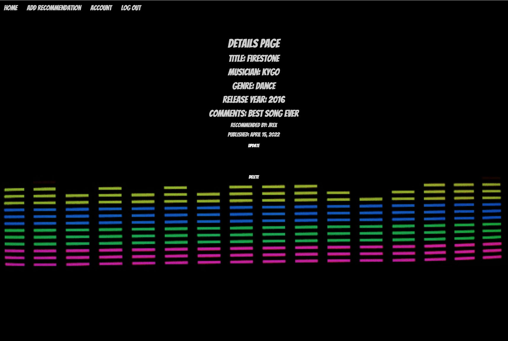
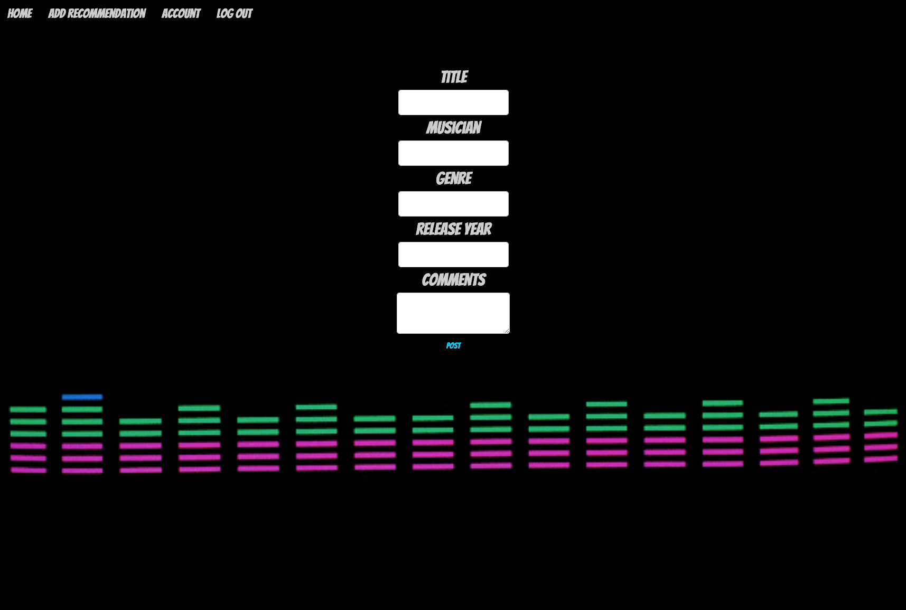

# What Song?

**WELCOME TO MY APPLICATION, WHAT SONG?.** Are you tired of listening to the same old music? Do you want to experiment with other genres and musicians? Look no further, What Song? is an application were you can find songs and albums recommendations posted by users all over the world. **Expand your music taste with, What Song?**

# Getting Started

<a href="https://what-song-jr.herokuapp.com/">DISCOVER NEW MUSIC</a>

# Screenshots

# Technologies Used

  

  

  

  

  

  

  

  

  

  

  

# What's next?

- [ ] The ability for users to pin favorite songs.
- [ ] The ability for users to create playlists. 
- [ ] Add Light/Dark Mode.